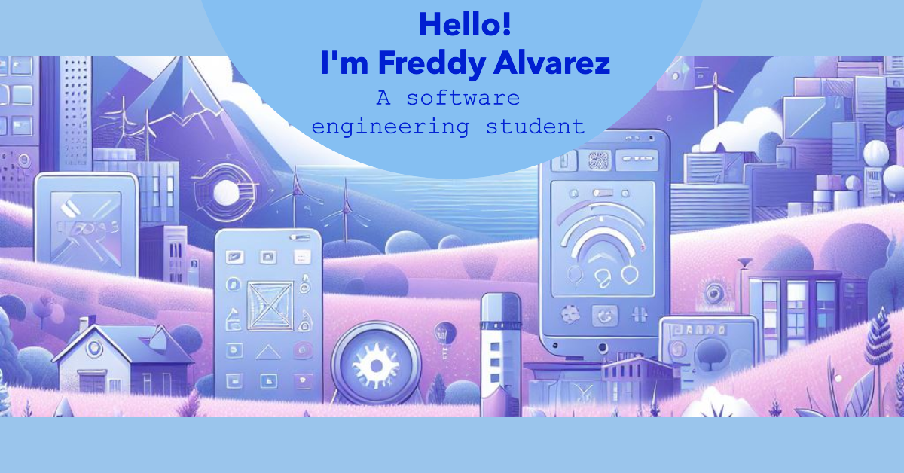

# Welcome to My GitHub Profile! 👋
Hello, I'm Freddy Alvarez, a  software student at the Technical University of Ambato. I specialize in Java programming, web development, and have a strong interest in backend. 
In my free time, I enjoy exploring the world of the technology and I like to programm.

## About Me
- 🎓 **Student:** Software at Technical University of Ambato
- 💻 **Specialties:** Java
- 🤖 **Interests:** IA and backend development
- 🌱 I’m currently learning web development and JAVA
- 👯 I’m looking to collaborate on project because I like to learn new things.

## 📈 GitHub Stats
 

## 📫 How to Reach Me
- **Portfolio:** [https://freddya12.github.io/ProfilePersonal/)
