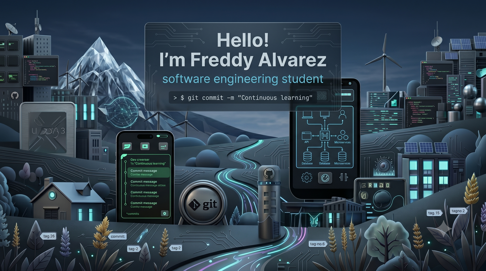

 

# Hi, I'm Freddy Alvarez 👋

### Software Engineering Student · Universidad Técnica de Ambato

 

---

## About Me

Software Engineering student at FISEI — Universidad Técnica de Ambato. I enjoy building web applications, working on backend systems, and exploring how technology can solve real problems. Always learning, always building.

**Interests:** Backend development · Web security · AI · Music · Philosophy

---

## Tech Stack

**Backend**

**Frontend**

**Database**

**Tools**

---

## Certifications

- Google — *Fundamentos del Marketing Digital*
- Google — *Transformación Digital*

---

## GitHub Stats

---

